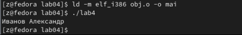

---
## Front matter
title: "Отчет по лабораторной работе № 4"
subtitle: "Архитектура компьютера"
author: "Иванов Александр Олегович"

## Generic otions
lang: ru-RU
toc-title: "Содержание"

## Bibliography
bibliography: bib/cite.bib
csl: pandoc/csl/gost-r-7-0-5-2008-numeric.csl

## Pdf output format
toc: true # Table of contents
toc-depth: 2
lof: true # List of figures
lot: true # List of tables
fontsize: 12pt
linestretch: 1.5
papersize: a4
documentclass: scrreprt
## I18n polyglossia
polyglossia-lang:
  name: russian
  options:
	- spelling=modern
	- babelshorthands=true
polyglossia-otherlangs:
  name: english
## I18n babel
babel-lang: russian
babel-otherlangs: english
## Fonts
mainfont: PT Serif
romanfont: PT Serif
sansfont: PT Sans
monofont: PT Mono
mainfontoptions: Ligatures=TeX
romanfontoptions: Ligatures=TeX
sansfontoptions: Ligatures=TeX,Scale=MatchLowercase
monofontoptions: Scale=MatchLowercase,Scale=0.9
## Biblatex
biblatex: true
biblio-style: "gost-numeric"
biblatexoptions:
  - parentracker=true
  - backend=biber
  - hyperref=auto
  - language=auto
  - autolang=other*
  - citestyle=gost-numeric
## Pandoc-crossref LaTeX customization
figureTitle: "Рис."
tableTitle: "Таблица"
listingTitle: "Листинг"
lofTitle: "Список иллюстраций"
lotTitle: "Список таблиц"
lolTitle: "Листинги"
## Misc options
indent: true
header-includes:
  - \usepackage{indentfirst}
  - \usepackage{float} # keep figures where there are in the text
  - \floatplacement{figure}{H} # keep figures where there are in the text
---

# Цель работы

Освоение процедуры компиляции и сборки программ, написанных на ассемблере NASM"

# Теоретическое введение

Язык ассемблера (assembly language, сокращённо asm) — машинно-ориентированный
язык низкого уровня. Можно считать, что он больше любых других языков приближен к
архитектуре ЭВМ и её аппаратным возможностям, что позволяет получить к ним более
полный доступ, нежели в языках высокого уровня, таких как C/C++, Perl, Python и пр. Заметим,
что получить полный доступ к ресурсам компьютера в современных архитектурах нельзя,
самым низким уровнем работы прикладной программы является обращение напрямую к
ядру операционной системы. Именно на этом уровне и работают программы, написанные
на ассемблере. Но в отличие от языков высокого уровня ассемблерная программа содержит
только тот код, который ввёл программист. Таким образом язык ассемблера — это язык, с
помощью которого понятным для человека образом пишутся команды для процессора.
Следует отметить, что процессор понимает не команды ассемблера, а последовательности
из нулей и единиц — машинные коды. До появления языков ассемблера программистам
приходилось писать программы, используя только лишь машинные коды, которые были
крайне сложны для запоминания, так как представляли собой числа, записанные в двоичной
или шестнадцатеричной системе счисления. Преобразование или трансляция команд с Архитектура ЭВМ
языка ассемблера в исполняемый машинный код осуществляется специальной программой
транслятором — Ассемблер.
Программы, написанные на языке ассемблера, не уступают в качестве и скорости програм-
мам, написанным на машинном языке, так как транслятор просто переводит мнемонические
обозначения команд в последовательности бит (нулей и единиц).

# Выполнение лабораторной работы

Создание каталога для работы с программами на языке ассемблера NASM (рис. @fig:001).

{#fig:001 width=70%}

Переход в созанный каталог (рис. @fig:002)

{#fig:002 width=70%}

Создание текстового файла с именем hello.asm (рис. @fig:003)

{#fig:003 width=70%}

Превращение текста программы в объектный код (рис. @fig:004)

{#fig:003 width=70%}

Компилирование исходного файла hello.asm в obj.o (опция -o позволяет
задать имя объектного файла, в данном случае obj.o), при этом формат выходного файла
будет elf, и в него будут включены символы для отладки (опция -g), кроме того, будет создан
файл листинга list.lst (опция -l) (рис. @fig:005).

{#fig:005 width=70%}

Отправка объектоного файла на обработку компановщику(рис. @fig:006)

{#fig:006 width=70%}

Запуск на выполнение созданный файл(рис. @fig:007)
 
{#fig:007 width=70%}

# Самостоятельная работа

Создание копии файла hello.asm  с именем lab4.asm(рис. @fig:008)
 
{#fig:008 width=70%}

Транслирование полученного текста программы lab4.asm в объектный файл. Выполнение
компоновки объектного файла и запуск получившегося  исполняемого файла (рис. @fig:009)
 
{#fig:009 width=70%}

 

# Выводы

В ходе лабораторной работы я освоил язык программирования низкого уровня асемблер, а имеено научился компилировать и собирать программы

::: {#refs}
:::
