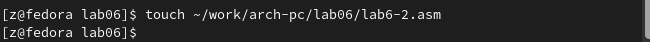

---
## Front matter
title: "Отчет по лабораторной работе №6"
subtitle: "Архитектура компьютера"
author: "Иванов Александр Олегович"

## Generic otions
lang: ru-RU
toc-title: "Содержание"

## Bibliography
bibliography: bib/cite.bib
csl: pandoc/csl/gost-r-7-0-5-2008-numeric.csl

## Pdf output format
toc: true # Table of contents
toc-depth: 2
lof: true # List of figures
lot: true # List of tables
fontsize: 12pt
linestretch: 1.5
papersize: a4
documentclass: scrreprt
## I18n polyglossia
polyglossia-lang:
  name: russian
  options:
	- spelling=modern
	- babelshorthands=true
polyglossia-otherlangs:
  name: english
## I18n babel
babel-lang: russian
babel-otherlangs: english
## Fonts
mainfont: PT Serif
romanfont: PT Serif
sansfont: PT Sans
monofont: PT Mono
mainfontoptions: Ligatures=TeX
romanfontoptions: Ligatures=TeX
sansfontoptions: Ligatures=TeX,Scale=MatchLowercase
monofontoptions: Scale=MatchLowercase,Scale=0.9
## Biblatex
biblatex: true
biblio-style: "gost-numeric"
biblatexoptions:
  - parentracker=true
  - backend=biber
  - hyperref=auto
  - language=auto
  - autolang=other*
  - citestyle=gost-numeric
## Pandoc-crossref LaTeX customization
figureTitle: "Рис."
tableTitle: "Таблица"
listingTitle: "Листинг"
lofTitle: "Список иллюстраций"
lotTitle: "Список таблиц"
lolTitle: "Листинги"
## Misc options
indent: true
header-includes:
  - \usepackage{indentfirst}
  - \usepackage{float} # keep figures where there are in the text
  - \floatplacement{figure}{H} # keep figures where there are in the text
---

# Цель работы

Цель данной лабораторной работы - освоение арифметческих инструкций языка ассемблера NASM.

# Теоретическое введение

Большинство инструкций на языке ассемблера требуют обработки операндов. Адрес операнда предоставляет место, где хранятся данные, подлежащие обработке. Это могут быть данные хранящиеся в регистре или в ячейке памяти.

    Регистровая адресация – операнды хранятся в регистрах и в команде используются имена этих регистров, например: mov ax,bx.
    Непосредственная адресация – значение операнда задается непосредственно в команде, Например: mov ax,2.
    Адресация памяти – операнд задает адрес в памяти. В команде указывается символическое обозначение ячейки памяти, над содержимым которой требуется выполнить операцию.

Ввод информации с клавиатуры и вывод её на экран осуществляется в символьном виде. Кодирование этой информации производится согласно кодовой таблице символов ASCII. ASCII – сокращение от American Standard Code for Information Interchange (Американский стандартный код для обмена информацией). Согласно стандарту ASCII каждый символ кодируется одним байтом. Среди инструкций NASM нет такой, которая выводит числа (не в символьном виде). Поэтому, например, чтобы вывести число, надо предварительно преобразовать его цифры в ASCII-коды этих цифр и выводить на экран эти коды, а не само число. Если же выводить число на экран непосредственно, то экран воспримет его не как число, а как последовательность ASCII-символов – каждый байт числа будет воспринят как один ASCII-символ – и выведет на экран эти символы. Аналогичная ситуация происходит и при вводе данных с клавиатуры. Введенные данные будут представлять собой символы, что сделает невозможным получение корректного результата при выполнении над ними арифметических операций. Для решения этой проблемы необходимо проводить преобразование ASCII символов в числа и обратно.

# Выполнение лабораторной работы

Создание рабочего каталога и рабочего файла для выполнение 6 лабораторной работы (рис. @fig:001).

{#fig:001 width=70%}

Создание программы вывода значения регистра eax(рис. @fig:002).

{#fig:002 width=70%}

Создание исполняемого файла и его запуск(рис. @fig:003).

{#fig:003 width=70%}

Замена символов на регистры чисел(рис. @fig:004).

{#fig:004 width=70%}

Создание файла новой  программы  и его запуск(рис. @fig:005).

{#fig:005 width=70%}

Создание исполняемого файла lab6-2.asm (рис. @fig:006).

{#fig:006 width=70%}

Создание программы вывода значения регистра eax с использовнием in out.asm и ее запуск(рис. @fig:007).

{#fig:007 width=70%}

Редактировние программы вывода значения регистра eax с использовнием in out.asm(рис. @fig:008).

{#fig:008 width=70}

Создание исполняемого файла и его запуск(рис. @fig:009).

{#fig:009 width=70}

Создание исполняемого файла lab6-3.asm (рис. @fig:010).

{#fig:010 width=70%}

Создание программы вычисления выражения (5 * 2 + 3)/3 (рис. @fig:011).

{#fig:011 width=70}

Запуск программы вычисления выражения (5 * 2 + 3)/3 (рис. @fig:012).

{#fig:012 width=70}

Создание программы вычисления выражения (4 * 6 + 2)/5 (рис. @fig:013).

{#fig:013 width=70}

Запуск программы вычисления выражения (4 * 6 + 2)/5 (рис. @fig:014).

{#fig:014 width=70}

Создание исполняемого файла variant.asm (рис. @fig:015).

{#fig:015 width=70%}

Создание программы вычисления  варианта задания по номеру студенческого билета и ее запуск(рис. @fig:016).

{#fig:016 width=70%}

# Ответы на вопросы
1)За вывод сообщения "Ваш вариант" отвечают строки кода:
mov eax,rem
call sprint

2)Инструкция mov ecx, x используется, чтобы положить адрес вводимой строки x в регистр ecx mov edx, 80 - запись в регистр edx длины вводимой строки call sread - вызов подпрограммы из внешнего файла, обеспечивающей ввод сообщения с клавиатуры

3)call atoi используется для вызова подпрограммы из внешнего файла, которая преобразует ascii-код символа в целое число и записывает результат в регистр eax

4)За вычисления варианта отвечают строки:
xor edx,edx ; обнуление edx для корректной работы div
mov ebx,20 ; ebx = 20
div ebx ; eax = eax/20, edx - остаток от деления
inc edx ; edx = edx + 1

5)При выполнении инструкции div ebx остаток от деления записывается в регистр edx

6)Инструкция inc edx увеличивает значение регистра edx на 1

7)За вывод на экран результатов вычислений отвечают строки:
mov eax,edx
call iprintLF

# Самостоятельная работа

Создание исполняемого файла ans.asm (рис. @fig:017).

{#fig:017 width=70%}

Создание программы вычисления выражения (x * 31 - 5) + 10 (рис. @fig:018).

{#fig:018 width=70}

Запуск программы вычисления выражения (x * 31 - 5) + 10 (рис. @fig:019).

{#fig:019 width=70}

# Выводы

При выполнении данной лабораторной работы я освоила арифметические инструкции языка ассемблера NASM.

# Список литературы{.unnumbered}

::: {#refs}
:::
