---
## Front matter
title: "Лабораторная работа № 7"
subtitle: "Архитектура компьютера"
author: "Иванов Александр"

## Generic otions
lang: ru-RU
toc-title: "Содержание"

## Bibliography
bibliography: bib/cite.bib
csl: pandoc/csl/gost-r-7-0-5-2008-numeric.csl

## Pdf output format
toc: true # Table of contents
toc-depth: 2
lof: true # List of figures
lot: true # List of tables
fontsize: 12pt
linestretch: 1.5
papersize: a4
documentclass: scrreprt
## I18n polyglossia
polyglossia-lang:
  name: russian
  options:
	- spelling=modern
	- babelshorthands=true
polyglossia-otherlangs:
  name: english
## I18n babel
babel-lang: russian
babel-otherlangs: english
## Fonts
mainfont: PT Serif
romanfont: PT Serif
sansfont: PT Sans
monofont: PT Mono
mainfontoptions: Ligatures=TeX
romanfontoptions: Ligatures=TeX
sansfontoptions: Ligatures=TeX,Scale=MatchLowercase
monofontoptions: Scale=MatchLowercase,Scale=0.9
## Biblatex
biblatex: true
biblio-style: "gost-numeric"
biblatexoptions:
  - parentracker=true
  - backend=biber
  - hyperref=auto
  - language=auto
  - autolang=other*
  - citestyle=gost-numeric
## Pandoc-crossref LaTeX customization
figureTitle: "Рис."
tableTitle: "Таблица"
listingTitle: "Листинг"
lofTitle: "Список иллюстраций"
lotTitle: "Список таблиц"
lolTitle: "Листинги"
## Misc options
indent: true
header-includes:
  - \usepackage{indentfirst}
  - \usepackage{float} # keep figures where there are in the text
  - \floatplacement{figure}{H} # keep figures where there are in the text
---

# Цель работы

Изучение команд условного и безусловного переходов. Приобретение навыков написания
программ с использованием переходов. Знакомство с назначением и структурой файла
листинга.

# Задание

Здесь приводится описание задания в соответствии с рекомендациями
методического пособия и выданным вариантом.

# Теоретическое введение

Для реализации ветвлений в ассемблере используются так называемые команды передачи
управления или команды перехода. Можно выделить 2 типа переходов:
• условный переход – выполнение или не выполнение перехода в определенную точку
программы в зависимости от проверки условия.
• безусловный переход – выполнение передачи управления в определенную точку про-
граммы без каких-либо условий.

# Выполнение лабораторной работы

Создание рабочего каталога и рабочего файла (рис. @fig:001).

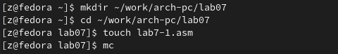{#fig:001 width=70%}

Запуск программы вывода сообщения (рис. @fig:002).

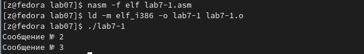{#fig:002 width=70%}

Редактирование программы (рис. @fig:003).

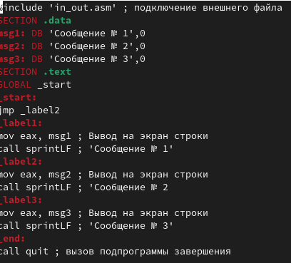{#fig:003 width=70%}

Запуск программы вывода сообщения (рис. @fig:004).

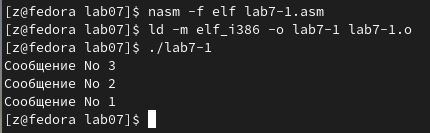{#fig:004 width=70%}

Проверка работы программы сравнения чисел (рис. @fig:005).

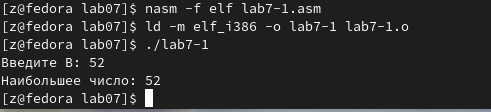{#fig:005 width=70%}

Удаление одного из операндов (рис. @fig:006).

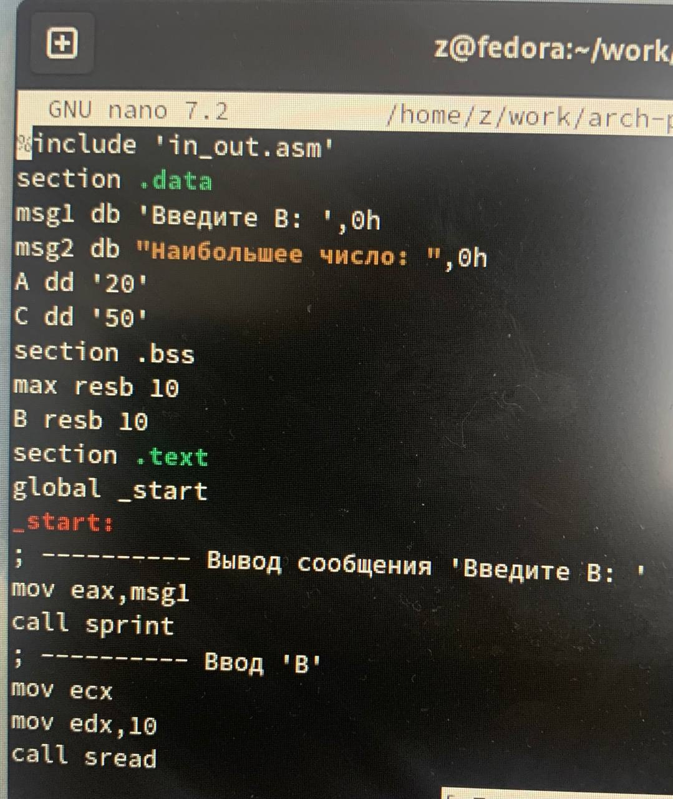{#fig:006 width=70%}

Вывод результата отредактированной программы (рис. @fig:007).

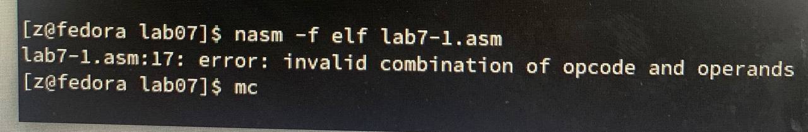{#fig:007 width=70%}

# Самостоятельная работа

Написание прграммы для сравнения трех чисел (рис. @fig:008).

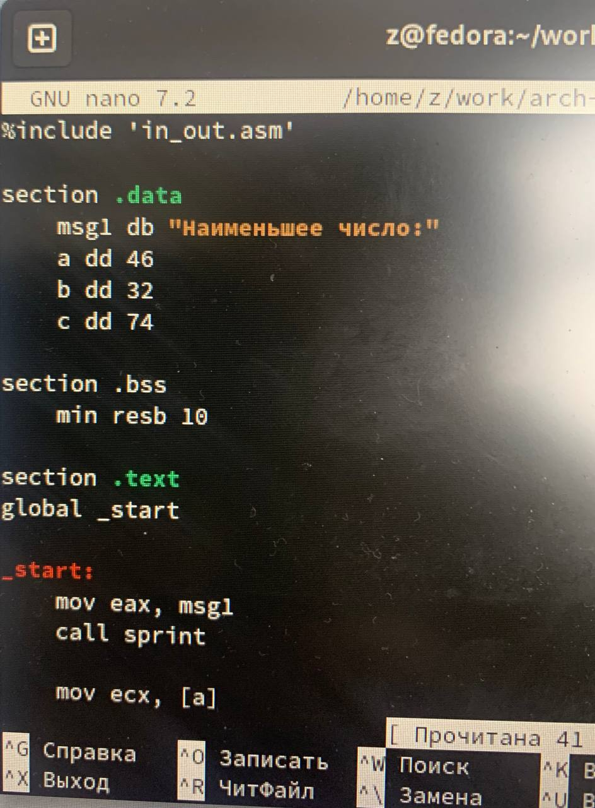{#fig:008 width=70%}

Вывод результатов программы (рис. @fig:009).

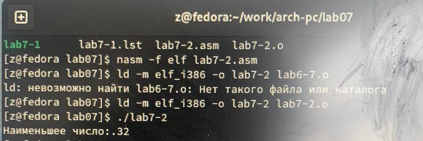{#fig:009 width=70%}

Написание программы для вычесления функции по заданным значениям(рис. @fig:010).

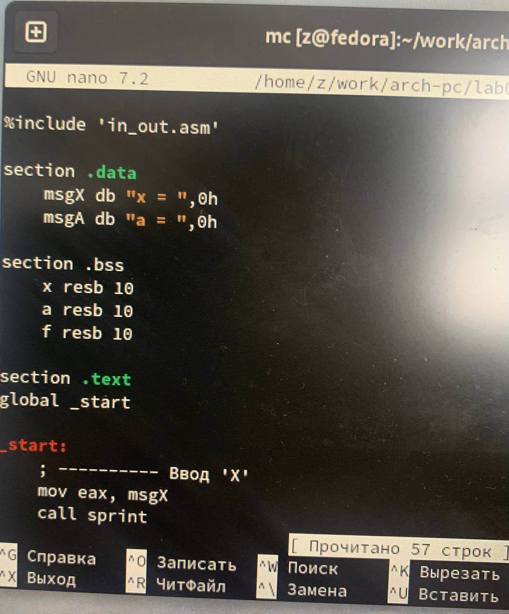{#fig:010 width=70%}

Проверка корректности выполнения программы(рис. @fig:011).

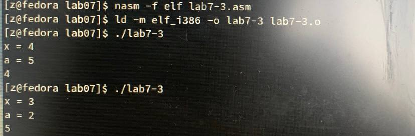{#fig:011 width=70%}

# Выводы

В ходе лабораторной работы я изучил  команды условного и безусловного переходов, приобрел навыки написания программ с использованием переходов, познакомился с назначением и структурой файла листинга.

# Список литературы{.unnumbered}

::: {#refs}
:::
